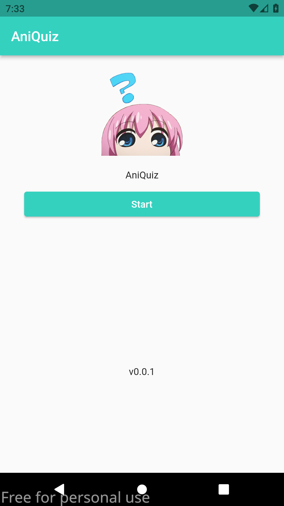

# aniquiz

 aniQuiz is a simple quiz app for weebs (anime and manga fans) made with flutter application.

# Usage 

## Installation

  Apk file of the latest build can be found in [release](https://github.com/Besufikad17/aniQuiz/releases/tag/v0.0.1) section.

1. Cloning the repo

   ```bash
    git clone https://github.com/Besufikad17/aniQuiz.git && cd aniQuiz
   ```
2. Installing packages

   ```bash
    flutter pub get
   ```
3. Running the application

   ```bash
    flutter run
   ```
# Preview

   **Home**
   
   **Question**
   
   **Result**
   